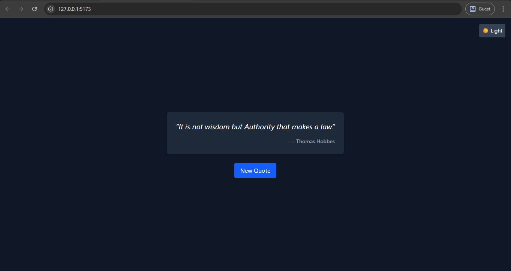

# 🧠 Quote Generator

A minimal quote generator built with **React + TailwindCSS**. Fetches quotes from the [Quotable API](https://api.quotable.io).

## 🚀 Features

- Fetches a random quote on page load
- “New Quote” button to fetch a fresh quote
- Dark mode toggle (☀️ / 🌙)
- Responsive mobile-first layout
- Fade-in animation on quote change
- Fully built with Tailwind + Vite

## 🖼️ Preview



## 🛠️ Stack

- React (via Vite)
- TailwindCSS
- Quotable API

## 📦 Installation

```bash
git clone https://github.com/Bulwark-Inc/Learning-Lab.git/level_one/quote-generator
cd quote-generator
npm install
npm run dev
```

🌐 Live Demo
comming soon...