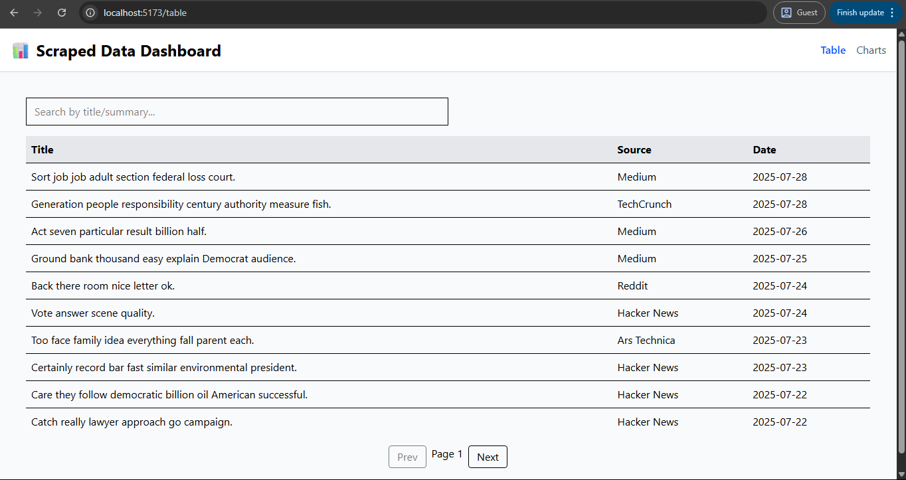

# 📊 Scraped Data Dashboard – React + Django + DRF

A full-stack dashboard to visualize scraped or AI-enriched data — built with Django REST Framework and React. Includes charts, filtering, JWT login, and CSV export for a clean, useful UI.

---

## ✨ Features

- 📑 View and search scraped entries in a table
- 📈 Interactive charts (entries over time, source frequency)
- 🔍 Filter and search via API
- 🌗 Dark mode toggle
- ⬇️ Download data as CSV
- 🔐 JWT-authenticated API with login UI
- ☁️ Deployed with Vercel + Render

---

## 🖼️ Preview



---

## 🛠️ Tech Stack

| Layer    | Tools Used                            |
|----------|----------------------------------------|
| Frontend | React + TailwindCSS + Axios + Chart.js |
| Backend  | Django + Django REST Framework         |
| Auth     | JWT via SimpleJWT                      |
| Dev      | dotenv, react-router-dom, CORS         |
| Deploy   | Render (API) + Vercel (frontend)       |

---

## 📦 Setup Instructions

### 1. Backend (Django + DRF)

```bash
git clone https://github.com/yourusername/dashboard-app
cd scraped-dashboard/backend

python -m venv venv
source venv/bin/activate  # or .\venv\Scripts\activate
pip install -r requirements.txt

cp .env.example .env  # Add Django secret + debug settings

python manage.py migrate
python manage.py runserver

# In a new terminal
cd dashboard-app/frontend
cp .env.example .env

npm install
npm run dev

# set in .env
VITE_API_URL=http://127.0.0.1:8000/api
```
---
### 🔐 Auth Flow
Login: /login/ (JWT token stored in localStorage)
API uses Bearer token via Axios interceptor

## 📊 Sample Endpoints
| Method | Endpoint                    | Description            |
| ------ | --------------------------- | ---------------------- |
| GET    | `/api/scraped-data/`        | List paginated entries |
| GET    | `?search=gpt&source=Reddit` | Filtering/search       |
| POST   | `/api/token/`               | JWT login              |
---

## ✅ Built as Level 3 Final Project
- 🚀 Goal: Full-stack freelance-ready dashboard
- 🎯 Challenge: Structured API, React charts, auth
- 📢 Shared on Reddit for feedback & visibility

### 🙌 Feedback / Collab
- Reddit: u/ChemicalWear6153
- GitHub: @yourusername

- Pull requests welcome – and happy to collab if you want to build extensions (AI summaries, CSV uploads, etc.)