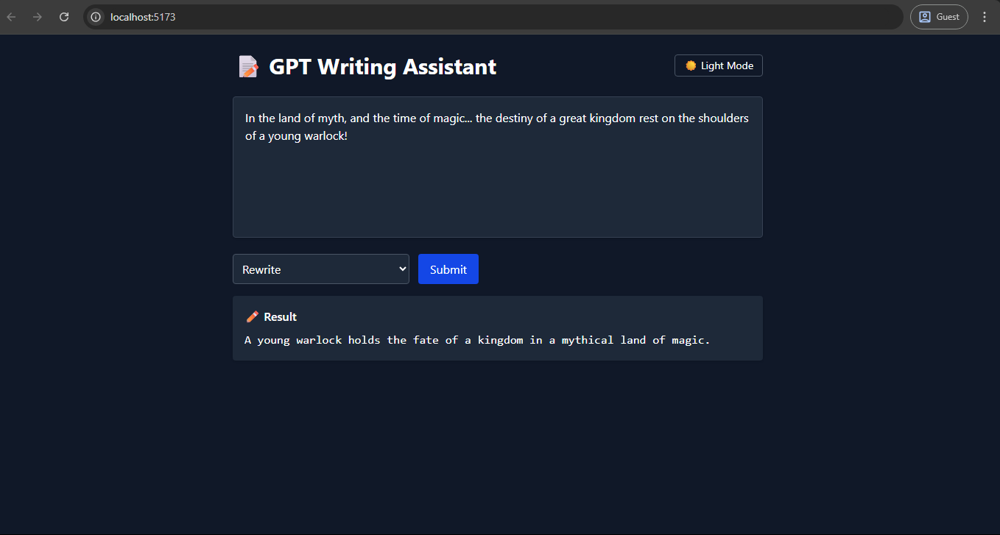

# 📝 GPT Writing Assistant – React + Django + OpenAI

A fullstack writing assistant that rewrites or summarizes text using the OpenAI API. Built with:

- 🧠 **Django REST Framework** for the API backend
- ⚛️ **React + TailwindCSS** frontend
- 🤖 **OpenAI API** for text generation
- 🌙 **Dark Mode**, responsive layout, and secure `.env` support

---

## ✨ Features

- Paste long text → Rewrite or Summarize it via GPT
- Dark mode toggle 🌗
- Uses OpenAI securely via backend proxy
- Smooth UI with fade-in animations
- Fully responsive + mobile-friendly

---
## 🖼️ Preview


---

## 🛠️ Tech Stack

| Layer      | Tools Used                   |
|------------|-------------------------------|
| Frontend   | React, Vite, TailwindCSS      |
| Backend    | Django, Django REST Framework |
| AI API     | OpenAI SDK                    |
| UI/UX      | Dark mode, loading states     |
| Deployment | Render (backend), Vercel (frontend) |

---

## 📦 Local Setup 

### 1. Backend (Django)

```bash
git clone https://github.com/Bulwark-Inc/Learning-Lab.git/level_three/gpt-writing-assistant # clone sub-repo
cd gpt-writing-assistant/backend
python -m venv venv
source venv/bin/activate  # or venv\Scripts\activate on Windows
pip install -r requirements.txt

# Add your OpenAI API key
cp .env.example .env

# Add your Django Secret key
# run this to create a new django secret key
python -c "from django.core.management.utils import get_random_secret_key; print(get_random_secret_key())" # add to ur .env

python manage.py migrate
python manage.py runserver
```

### 2. Frontend (React)
```bash
# In a different terminal
cd gpt-writing-assistant/frontend
npm install
npm run dev
```
---
## 🔗 API Endpoints

| Endpoint          | Method | Description             |
| ----------------- | ------ | ----------------------- |
| `/api/rewrite/`   | POST   | Rewrites submitted text |
| `/api/summarize/` | POST   | Summarizes the text     |

```bash
{
  "text": "Paste your long text here...",
  "mode": "rewrite" // or "summarize"
}
```
---

## ✅ Credits
- Part of Level 3 – Fullstack Integration & Showoff Phase
- Built by: @Bulwark-Inc
- Share feedback: /u/ChemicalWear6153

## (Optional) Make sure .env in your frontend has:
VITE_API_BASE=http://127.0.0.1:8000