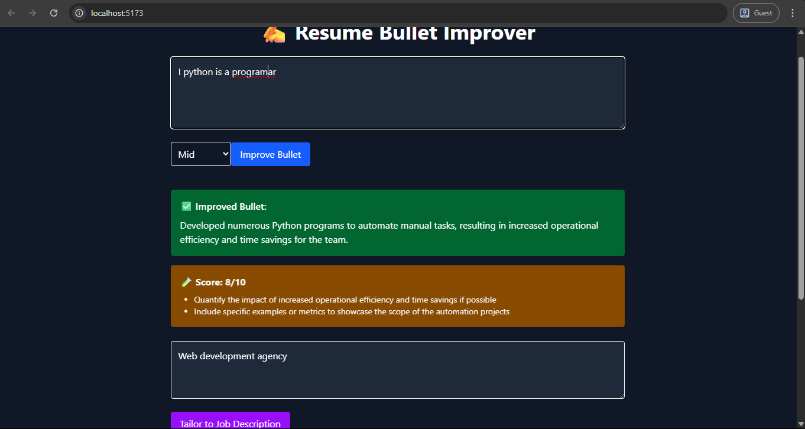

# 📝 Resume Bullet Improver – React + Django + OpenAI

A smart AI-powered tool to rewrite your resume bullets, tailor them to job descriptions, and preview your experience section.

---

## ✨ Features

- ✅ Paste a resume bullet → Get an improved, GPT-powered version
- 📊 Instant score + writing tips
- 🛠 Tailor bullets to job descriptions
- 🧾 Resume section preview (no login needed)
- 🌗 Dark mode toggle
- 🎬 Fade-in animations
- 🔐 Powered by Django, DRF, and OpenAI API

---

## 🖼️ Preview



---

## 🛠️ Tech Stack

| Layer    | Tools Used                |
|----------|----------------------------|
| Frontend | React + TailwindCSS + Axios |
| Backend  | Django REST Framework + OpenAI |
| AI       | GPT-4 via OpenAI SDK      |
| Dev      | dotenv, Postman, Framer Motion |
| Deploy   | Render (backend) + Vercel (frontend)

---

## 📦 Setup Instructions

### 1. Backend (Django)

```bash
git clone https://github.com/Bulwark-Inc/Learning-Lab.git/level_three/resume-improver
cd resume-improver/backend

python -m venv venv
source venv/bin/activate   # or .\venv\Scripts\activate (Windows)
pip install -r requirements.txt

cp .env.example .env   # Add your OpenAI key + Django secret key

python manage.py migrate
python manage.py runserver
```

### 2. Frontend (React)
```bash
# In a different terminal
cd resume-improver/frontend
code .env
npm install
npm run dev
```
Ensure to add:
```bash
VITE_API_BASE=http://127.0.0.1:8000/api
```
to the .env file in the frontend folder
---

## 🔌 API Endpoints

### POST /api/improve/
#### Request:
```bash
{
  "bullet": "Managed a team of developers",
  "level": "Manager"
}
```
#### Response
```bash
{
  "result": "Led a cross-functional development team of 8, delivering 3 projects on time and under budget."
}
```

### POST /api/score/
- Returns feedback and score on the bullet.

### POST /api/tailor/
#### Request
```bash
{
  "bullet": "Designed user flows for a mobile app",
  "job_description": "Looking for UX designers with mobile experience"
}
```
#### Response
```bash
{
  "tailored": "Designed intuitive mobile user flows tailored to business goals, aligning with UX requirements from job spec."
}
```
---

### ✅ Built As Part of Learning Level 3
- 🎯 Project: “Simple SaaS AI Tool”
- 🧠 Goal: Build a clean UX around AI + Resume logic
- 🔓 No auth/login — built for demo and learning

## 🙌 Contribute / Feedback
Reddit: /u/ChemicalWear6153
GitHub: @Bulwark-Inc