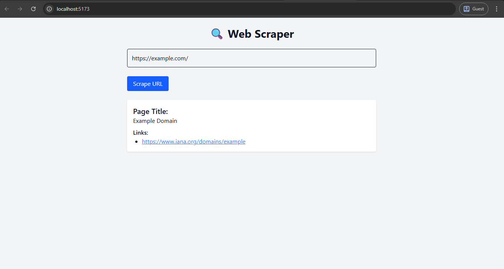

# 🌐 Web Scraper API – Django + React + BeautifulSoup

Send a URL → Scrape its title + links → Get JSON result.  
Built with Django REST Framework and BeautifulSoup, with a React + Tailwind frontend.

---

## 🚀 Features

- 🧠 Accepts any public URL (via POST)
- 🔗 Scrapes title and top links from page
- 🧼 Validates input and handles errors
- 💡 Optional link limit via `limit` param
- 🌓 Dark mode + responsive React UI

---

## 🖼️ Preview



---

## 🛠️ Tech Stack

| Layer      | Tools Used                 |
|------------|----------------------------|
| Backend    | Django, DRF, BeautifulSoup |
| Frontend   | React, TailwindCSS, Axios  |
| Auth       | None (dev mode)            |
| Dev Tools  | dotenv, requests, CORS     |

---

## 📦 Setup Instructions

### 1. Backend (Django)

```bash
git clone https://github.com/Bulwark-Inc/Learning-Lab.git/level_two/scraper_api
cd scraper_api/scraper_api_backend
python -m venv venv
source venv/bin/activate  # or venv\Scripts\activate on Windows
pip install -r requirements.txt

# Add your Secret key
cp .env.example .env

# Add your Django Secret key
# run this to create a new django secret key
python -c "from django.core.management.utils import get_random_secret_key; print(get_random_secret_key())" # add to ur .env

python manage.py migrate
python manage.py runserver
```

### 2. Frontend (React)
```bash
# In a different terminal
cd scraper_api/frontend
npm install
npm run dev
```

## 📫 API Endpoint
POST /api/scrape/

### Request
{
  "url": "https://example.com",
  "limit": 5
}


### Response
{
  "title": "Example Domain",
  "links": [
    "https://www.iana.org/domains/example"
  ],
  "total_links_found": 15
}

🎯 Credits
Part of my Level 2 Fullstack Dev Series