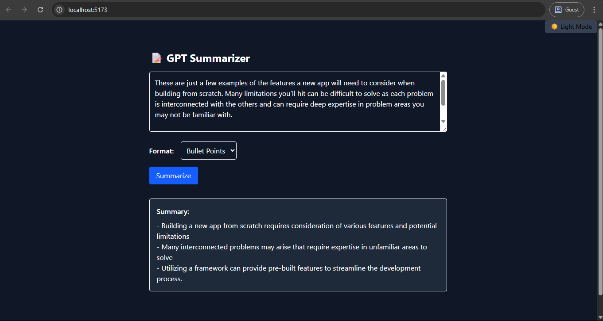

# 📝 GPT Summarizer Tool – React + Django + OpenAI

This is a fullstack summarization tool where users paste long text, and get a **concise summary** powered by OpenAI's GPT models.

---

## ✨ Features

- 📄 Paste long text → Get summary
- 🧠 Choose format: bullet points or paragraph
- 🌓 Dark mode toggle
- 🚀 Smooth fade-in animations
- 🔐 API backed by Django + DRF + OpenAI
- 📦 Easy local setup and deploy-ready

---

## 🖼️ Preview



---

## 🛠️ Tech Stack

| Layer      | Tools Used              |
|------------|--------------------------|
| Frontend   | React + TailwindCSS     |
| Backend    | Django + DRF + OpenAI SDK |
| API Client | Axios                   |
| Deploy     | Vercel (frontend), Render (backend)

---

## 📦 Setup Instructions

### 1. Backend (Django)

```bash
git clone https://github.com/Bulwark-Inc/Learning-Lab.git/level_two/summarizer
cd summarizer/backend
python -m venv venv
source venv/bin/activate  # or venv\Scripts\activate on Windows
pip install -r requirements.txt

# Add your OpenAI API key
cp .env.example .env

# Add your Django Secret key
# run this to create a new django secret key
python -c "from django.core.management.utils import get_random_secret_key; print(get_random_secret_key())" # add to ur .env

python manage.py migrate
python manage.py runserver
```

### 2. Frontend (React)
```bash
# In a different terminal
cd summarizer/frontend
npm install
npm run dev
```

---


## API Endpoint
POST /api/summarize/
Content-Type: application/json

{
  "text": "Paste your text here...",
  "mode": "paragraph"  // or "bullet"
}

### Response
{
  "summary": "This is a short summary of your input."
}

🙌 Credits
Built as part of Level 2 – API & AI Projects of my learning journey.